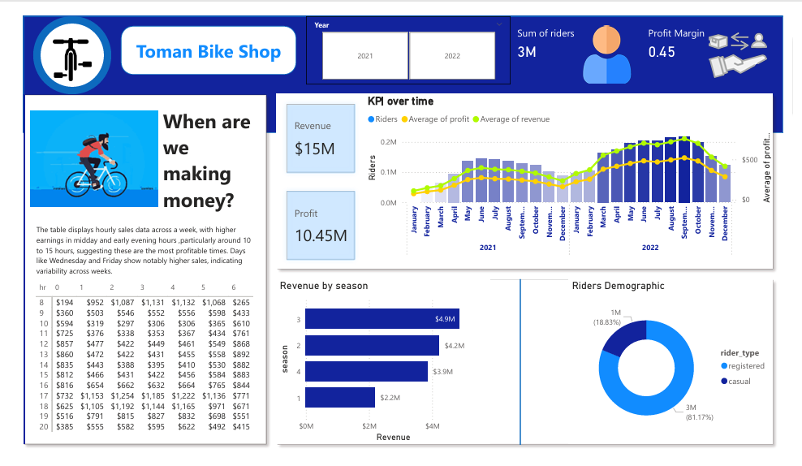

# Toman Bike Shop Analysis Reporting 

- You are a data analyst and "Toman Bike shop" has approached you for your services.
- They want to know if they can hike their prices for the next year based on available data of bike rentals and price senstivity. You are asked for a preliminary verison of the analysis asap.
- For analysis we used SQL and Power BI. 
- We analyzed the revenue trends and seasonal demand in order to understand what impact a price increase will have on ridership, profits, and revenues.

### Insights from analysis

- **Seasonal Trends:**  Besides, rentals also reflect a very strong seasonal demand cycle, peaking in summer and holiday months, with low returns in the lean months, though residual activities due to their daily commutation needs are not uncommon.

- **Revenue Trends:** Current pricing strategies ensure a consistent revenue level throughout the peak seasons. However, from the data obtained, even in previous slight price increases, demand was almost equal. This suggests that some leeway may be allowed for price increases without seriously affecting the rental volumes.

### Recommendations

- **Conservative Increase:** Considering the substantial increase last year,a more conservative increase might be prudent to avoid hitting a price ceiling where demand starts to drop.An increase in the range of 10-15% done during peak seasons, summer, and holidays could test the market's response without risking a significant loss of customers.

- **Price Setting:** 
    1. If the price in 2022 was $4.99, a 10% increase would make the new price about $5.49.
    2. A 155 increase would set the price at approximately $5.74.

- **Recommended Strategy:**
    1. **Market Analysis:** Conduct further market research to understand customer satisfaction,potential competitive changes,and the overall economic developement. This can guide whether leaning towards the lower or higher end of the suggested increase.
    2. **Segmented Pricing Strategy:** Consider different pricing for casual and registered riders,also for different age groups,as they may have different price strategy.
    3. **Monitor and Adjust:** Implement the new prices but be ready to adjust based on immediate customer feedback and sales data.Monitoring closely will allow you to fine tune your pricing strategy without comitting fully to a price that might turn out to be high. 